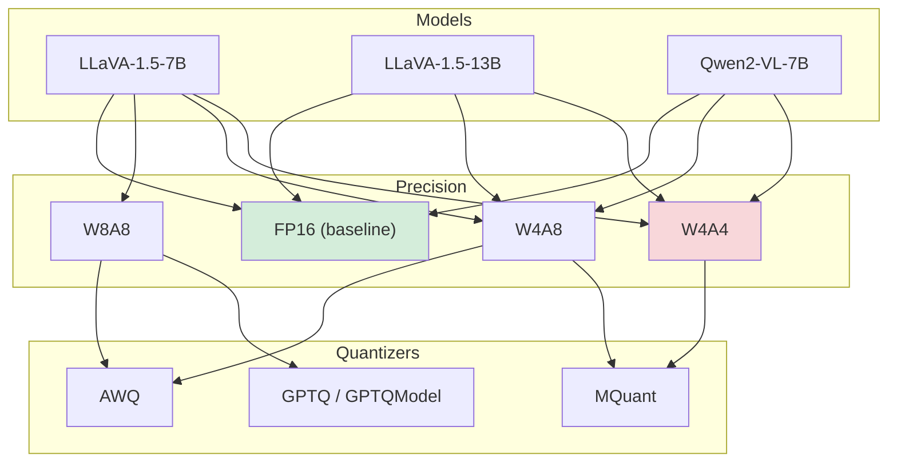
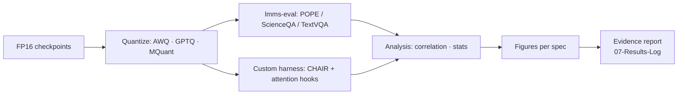

# Evidence Experiment Design

## 1. Goal

Establish the **existence and mechanism** of Lexical Fallback in quantized MLLMs: one dataset, identical prompts, a precision grid, hallucination + attention measurement on the same generations. **No training, no fine-tuning.** Results are logged in [[07-Results-Log]] as they complete.

## 2. Design Principles

1. **Same inputs, one variable at a time** — the only difference between cells is the quantization configuration.
2. **Two measurement families** — hallucination (task outcome) and attention (mechanism), measured *on the same generations*.
3. **Paired design** — identical seeds/prompts per image so FP16↔W4A4 differences are per-image, enabling paired statistics.
4. **Reproducible harness** — lmms-eval for POPE/ScienceQA/TextVQA + custom CHAIR ([[06-Supporting-Evidence#lmms-eval Coverage]]).

## 3. Ablation Matrix

> [!tip] Cell policy
> 3 models × {FP16, W8A8, W4A8, W4A4} with feasible quantizer per cell = **~14 evaluated cells**, 3 seeds each. W8A8 only on LLaVA-1.5-7B (cost control); W4A4 on all three models (the headline condition).

### Why these choices

- **FP16** — full-precision oracle (upper bound).
- **W8A8** — mild noise; establishes the slope of the degradation curve.
- **W4A8** — weight-only regime is *well-served* by AWQ/GPTQ; tests whether hallucinations already appear when weights collapse but activations survive.
- **W4A4** — weight+activation collapse; the regime where LUQ predicts failure ([[06-Supporting-Evidence#LUQ]]).

## 4. Models (architecture facts drive the attention design)

| Model | Vision encoder | Fusion | LLM | Visual tokens at input | Attention hook point |
|---|---|---|---|---|---|
| LLaVA-1.5-7B | CLIP ViT-L-14@336 | 2-layer MLP projector | Vicuna-7B (LLaMA-2) | 576 (24×24) | LLM self-attention, positions 0–575 |
| LLaVA-1.5-13B | CLIP ViT-L-14@336 | 2-layer MLP projector | Vicuna-13B (LLaMA-2) | 576 | LLM self-attention, positions 0–575 |
| Qwen2-VL-7B | 675M ViT (DFN init, 2D-RoPE) | MLP merger (2×2 → 1) | Qwen2-7B | 66 for 224² (64 merged + 2 specials), **input-dependent** | LLM self-attention over span between `<\|vision_start\|>` / `<\|vision_end\|>` |

> [!warning] No cross-attention anywhere
> Verified: both model families fuse vision into the LLM sequence and rely on **self-attention** ([[06-Supporting-Evidence#Architecture Facts]]). Our "cross-modal attention" metric = attention from generated tokens to visual-token positions in LLM self-attention layers.

> [!warning] Qwen2-VL variable spans
> Dynamic resolution ⇒ visual token count varies per image. Attention metrics must localize the visual span via the special tokens per input, not fixed indices.

## 5. Quantization Methods

| Method | Granularity | Notes (verified) | Cell coverage |
|---|---|---|---|
| **AWQ** | Weight-only W4 (g128) | mit-han-lab/llm-awq; needs self-run AWQ search for LLaVA-1.5; AutoAWQ supports llava & qwen2_vl | W4A8 (weights 4-bit, activations FP16) |
| **GPTQ** | Weight-only W4/W8 | AutoGPTQ archived Apr 2025 → use **GPTQModel**; transformers `GPTQConfig`, exclude vision tower via `modules_to_not_convert` | W4A8, W8A8 |
| **MQuant** | Weight+activation W4A8/W4A4 | Official release exists (arXiv:2502.00425, github.com/StiphyJay/MQuant); built on QuaRot Hadamard rotations + modality-specific scaling; reports W4A4 on LLaVA-1.5-13B | W4A4 (headline), W4A8 |
| QuaRot (fallback) | LLM-only W4A4 | **Not applicable to MLLMs** per MQuant; fallback only if MQuant unavailable | — |

> [!note] Weight-only vs weight+activation
> AWQ/GPTQ provide W4A16 — the "W4A8" label means 4-bit weights with FP16/8 activations. True W4A4 (activations quantized) requires MQuant-style weight+activation pipelines. Cells must state precisely what is quantized.

> [!danger] Calibration discipline
> All quantizers get the **same calibration data** (e.g., 128 samples from the MSCOCO train split, disjoint from evaluation images) to keep quantizer choice comparable.

## 6. Datasets & Protocols

| Benchmark | Protocol (verified) | Metric | Role |
|---|---|---|---|
| **POPE** (RUCAIBox) | 500 MSCOCO val2014 images (>3 GT objects) × 6 questions (3 yes/3 no) = 3,000 questions; splits: random / popular / adversarial | Accuracy, Precision, Recall, **F1** (major), yes-ratio | Primary hallucination probe |
| **CHAIR** (MLLM-era convention) | 500 images, MSCOCO val2014, one detailed caption per image; 80 MSCOCO object classes; synonym list; GT = instance seg ∪ reference captions | **CHAIR_s** (sentence-level), **CHAIR_i** (mention-level), lower = better | Fine-grained object hallucination + per-mention attention labels |
| **ScienceQA** | ~21k multimodal multiple-choice; accuracy | Accuracy | Reasoning integrity under quantization |
| **TextVQA** | Val split, VQA-style normalized accuracy | Accuracy | OCR grounding (perception, not prior) |

Harness: **lmms-eval** for POPE / ScienceQA / TextVQA (`pope`, `scienceqa_img`, `textvqa_val`); **custom CHAIR harness** built on `LisaAnne/Hallucination` `utils/chair.py` — CHAIR is *not* in lmms-eval ([[06-Supporting-Evidence#lmms-eval Coverage]]).

## 7. Controlled Variables

- Identical prompts per image across all cells; system prompts frozen.
- Decoding: **greedy** for CHAIR (deterministic captions), **nucleus (top-p=0.9, temp=1)** for POPE per community convention; identical seed per image.
- Same image preprocessing (336px / dynamic resolution per model, unchanged by quantization).
- All 3 seeds share the same per-image seed; results reported per cell with standard error.
- Quantizer calibration set disjoint from all evaluation splits.

## 8. Support Experiments (strengthen the causal claim)

> [!example] S1 — Noise-injection control (isolates noise from quantizer artifacts)
> At FP16, inject zero-mean Gaussian noise into visual embeddings with per-layer variance matched to the measured FP16↔W4A4 embedding error. If hallucinations track the *noise level* rather than the quantizer identity, the mechanism is representation noise — supporting the "fallback" account. Sweep σ across 2–3 levels to approximate the precision grid.

> [!example] S2 — Linguistic-prior probe (proves fallback to language prior)
> Run the model with the image masked (text-only condition). For each hallucinated mention from the quantized run, check whether it is high-probability under the text-only distribution. If yes → the token came from the linguistic prior, i.e., lexical fallback.

> [!example] S3 — Layer-depth attention profile
> Report visual attention mass per LLM layer. RBD-style finding: attention imbalance intensifies in deeper layers ([[06-Supporting-Evidence#Attention-Hallucination Evidence]]); quantization is expected to steepen this. Informs which layers carry the fallback signal.

## 9. Execution Pipeline

## 10. Study Outputs

What this study establishes, per hypothesis:

- **H1:** a monotone hallucination–precision curve (F1) — existence of the phenomenon.
- **H2:** quantified attention degradation (mass / entropy / drift) (F2, F5) — mechanism.
- **H3:** token-level grounding↔hallucination coupling with the functional form (F3, F4) — attribution.
- **H4:** the fallback timeline — attention collapse during generation (F2).
- **S1/S2/S3:** noise attribution, linguistic-prior provenance, and layer localization.

These outputs are logged cell-by-cell in [[07-Results-Log]] and form the evidence base for subsequent research phases (documented here as they begin).

## Related Notes

- [[01-Problem-and-Hypotheses]] — hypotheses H1–H4 this design tests
- [[03-Metrics-Definitions]] — formal definitions
- [[04-Visualization-Spec]] — expected plots per hypothesis
- [[05-Execution-Plan]] — phases & risks
- [[06-Supporting-Evidence]] — verification of every fact in §4–§6
- [[07-Results-Log]] — where per-cell results are recorded