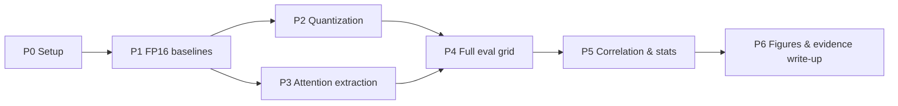

# Execution Plan

## 1. Principles

- **Zero training compute.** All work is inference + quantization + analysis. GPU needs: 1× 24–48GB GPU (or Colab-class) suffices for 7B; 13B cells need 24GB+ or offloading.
- **Reproduce-before-trust**: every harness validated against published FP16 numbers *before* quantized runs.
- **Log everything**: per-cell artifacts (generations, attention tensors, configs) saved; results appended to [[07-Results-Log]]; analysis rerunnable from artifacts without re-inference.

## 2. Phases

| Phase                                | Deliverables                                                                                                                                                                              | Exit criteria                                                                                               |
| ------------------------------------ | ----------------------------------------------------------------------------------------------------------------------------------------------------------------------------------------- | ----------------------------------------------------------------------------------------------------------- |
| **P0 — Setup**                       | Env pinned (torch, transformers, lmms-eval, GPTQModel, AutoAWQ, MQuant); data downloaded (POPE, MSCOCO val2014 + captions/instances, ScienceQA, TextVQA); custom CHAIR harness scaffolded | `lmms-eval` smoke test on 10 samples                                                                        |
| **P1 — FP16 baselines**              | Full eval on all 3 models × 4 benchmarks × 3 seeds                                                                                                                                        | Numbers within ~1–2 pts of published (e.g., LLaVA-1.5-7B POPE-F1 ≈ 87.3/86.1/84.2)                          |
| **P2 — Quantization**                | AWQ (W4) + GPTQ (W4/W8) on LLaVA 7B/13B; MQuant W4A8/W4A4 on all 3 models; calibration data fixed; **FP16↔W4A4 embedding-error profile** (feeds S1 noise control)                         | Quantized checkpoints load & generate; no NaN/divergence                                                    |
| **P3 — Attention extraction**        | Hook suite on LLM self-attention; visual-span resolver (576-prefix for LLaVA; `<\|vision_start\|>`/`<\|vision_end\|>` span for Qwen2-VL); artifacts: per-token $a^{(l,h)}_{t,i}$          | Attention metrics computed on 20-sample smoke run; visual spans verified visually (F6-style heatmap sanity) |
| **P4 — Full eval grid**              | ~14 cells × 3 seeds × (POPE, CHAIR, ScienceQA, TextVQA) + S1 noise sweep + S2 text-only probe ([[02-Evidence-Experiment-Design#Support Experiments]])                                     | All artifacts stored; no missing cells; results logged in [[07-Results-Log]]                                |
| **P5 — Correlation & stats**         | r_pb with bootstrap CIs, binned curves, logistic fits, McNemar/Wilcoxon, BH correction ([[03-Metrics-Definitions#3]])                                                                     | Hypothesis verdicts H1–H4 with effect sizes                                                                 |
| **P6 — Figures & evidence write-up** | Figures F1–F8 ([[04-Visualization-Spec]]) + evidence report: the phenomenon (H1), mechanism (H2–H4), and support experiments (S1–S3)                                                      | All figures referenceable; story coherent; report appended to [[07-Results-Log]]                            |

## 3. Risks & Mitigations

| # | Risk | Impact | Mitigation |
|---|---|---|---|
| R1 | **AutoGPTQ archived** (Apr 2025) | GPTQ cells break | Use **GPTQModel** (maintained fork); pin transformers version verified by its docs ([[06-Supporting-Evidence#AWQ and GPTQ]]) |
| R2 | **AWQ is W4A16 weight-only** | "W4A8" cells ambiguous | State per-cell what is quantized; W4A8 via MQuant; treat AWQ cells as W4A16 label clarity |
| R3 | **MQuant is research code** (no pip package) | Install/version pain | Pin repo commit; verify against its reported W4A4 LLaVA-1.5-13B numbers (reproduce-before-trust); fallback = QuaRot-extended or fake-quant simulation |
| R4 | **Qwen2-VL attention complexity** (dynamic resolution, variable spans, 675M ViT compute) | Hook bugs, slow runs | Resolve visual span from special tokens per input; restrict Qwen2-VL to one resolution config; smoke-test hooks in P3 |
| R5 | **CHAIR not in lmms-eval** | Custom harness bugs | Build on `LisaAnne/Hallucination` `utils/chair.py`; validate against VCD/ReWEIGH published CHAIR numbers on FP16 |
| R6 | **LUQ already measures POPE on quantized MLLMs** (LLaVA-1.5, sub-4-bit) | Novelty attack | Differentiators: full precision grid incl. W8A8/W4A8, attention *mechanism*, both model families, hallucination as object of study ([[06-Supporting-Evidence#Gap Analysis]]) |
| R7 | **Quantized models degenerate** (garbage output at W4A4) | Metrics undefined | Pre-filter cells: if <30% of generations parse, mark cell "collapsed" and report it as a finding (collapse itself is evidence); use yes-ratio/CHAIR parse-rate as auxiliary signal |
| R8 | GPU memory for 13B cells | Slowdown | AWQ/GPTQ 4-bit 13B fits 24GB; MQuant W4A4 lighter; offload if needed |
| R9 | Attention-hallucination coupling weak at token level (H3 fails) | Mechanism claim weakened | Design hedge: coupling at *sentence/step-window* level may still hold (H4); report honestly — negative H3 with strong H1/H2 still establishes the phenomenon, and S2/S3 provide alternative mechanism evidence |

## 4. Artifact & Logging Conventions

- `results/<model>/<precision>/<quantizer>/<seed>/` — generations + metrics + attention tensors (compact per-token aggregates; raw tensors only for F6 candidates).
- `configs/` — exact quantization configs, prompts, seeds, calibration splits (immutable, hashed).
- Analysis scripts consume artifacts only → reruns are cheap and bit-identical.
- Every completed cell gets an entry in [[07-Results-Log]].

## Related Notes

- [[02-Evidence-Experiment-Design]] — what is being run
- [[03-Metrics-Definitions]] — metrics computed in P5
- [[04-Visualization-Spec]] — figures produced in P6
- [[06-Supporting-Evidence]] — risk evidence (R1–R6 sources)
- [[07-Results-Log]] — results appended here
- [[README]] — index