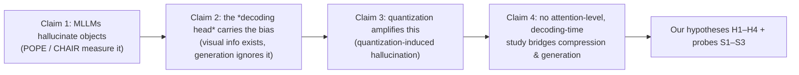

# Claims & Evidence Chain

> [!abstract] Purpose
> The argumentative spine of the research: each claim, its supporting primary sources, and how the chain motivates our hypotheses. Every claim links back to [[Research Ideation]] and the [[Study Experiment]]. New sources land here as they are verified.

## Claim 1 — MLLMs hallucinate objects; POPE and CHAIR are the standard measurement

**Statement.** Object hallucination (mentioning objects absent from the image) is a pervasive, measurable failure of MLLMs, and POPE (discriminative) + CHAIR (generative) are the field's canonical instruments.

**Evidence (primary sources):**
- **POPE** — Li et al. 2023, EMNLP. [arXiv:2305.10355](https://arxiv.org/abs/2305.10355) · [RUCAIBox/POPE](https://github.com/RUCAIBox/POPE). 500 val2014 images (>3 GT objects) × 6 yes/no questions; random/popular/adversarial splits; Acc/Prec/Recall/F1/yes-ratio. Contrastive by construction ([[Research Ideation#Key Verified Facts]]).
- **CHAIR** — Rohrbach et al. 2018, EMNLP. [arXiv:1809.02156](https://arxiv.org/abs/1809.02156) · [LisaAnne/Hallucination](https://github.com/LisaAnne/Hallucination). CHAIR_s / CHAIR_i over 80 COCO classes; MLLM-era convention = 500 val2014 images, one detailed caption each.
- **Adoption**: TGIF ([arXiv:2601.03100](https://arxiv.org/html/2601.03100v1)) uses POPE + HallusionBench as the hallucination metrics for LLaVA-1.5-7B; POPE/CHAIR appear across LLaVA-1.5, VCD, OPERA, Obliviate ([arXiv:2508.04567](https://arxiv.org/abs/2508.04567) uses POPE + Object HalBench + MMHal-Bench).
- **Benchmark evolution (active area)**: **POPEv2** (AAAI 2026, [arXiv:2508.04567](https://arxiv.org/abs/2508.04567), [repo](https://github.com/AoiDragon/POPEv2), [HF dataset](https://huggingface.co/datasets/Monosail/POPEv2)) — counterfactual masked-object pairs; **HOPE** ([arXiv:2508.06530](https://arxiv.org/abs/2508.06530), [repo](https://github.com/xiemk/HOPE)) — content-aware distractors; **HallusionBench** ([arXiv:2310.18834](https://arxiv.org/abs/2310.18834)) — entangled visual-illusion + language hallucination.

> [!warning] Caveat — POPE's known limits (cite honestly)
> HOPE ([arXiv:2508.06530](https://arxiv.org/abs/2508.06530)) argues POPE's category-statistics distractors have *diminishing effectiveness* on modern LVLMs (HOPE's harder distractors drop precision 9–23% more). Mitigation in our study: the **adversarial split** (co-occurrence traps) is the strongest POPE condition, and our mechanism analysis (attention) is orthogonal to benchmark saturation. Consider HOPE as a future extension.

## Claim 2 — The decoding head carries the hallucination bias (the mechanism)

**Statement.** Hallucination is not (only) a vision failure: object-level visual information is present in the model's representations, but the autoregressive head fails to use it and defaults to linguistic priors — the *lexical fallback* mechanism.

**Evidence (primary sources):**
- **POPEv2 probing** (AAAI 2026, [arXiv:2508.04567](https://arxiv.org/abs/2508.04567)) — **the key mechanistic citation**: probes on LLaVA hidden states reach ~94.9% object-classification accuracy (visual info IS encoded), yet generation accuracy is ~80.8% — "the primary training bias contributing to hallucination resides in the **LM head**," which "fails to correctly translate accurate visual representations into textual outputs." This is exactly our claim: representations are (or can be) fine; the **decoder falls back to priors**.
- **VCD** (CVPR 2024, [arXiv:2311.16922](https://arxiv.org/abs/2311.16922)) — hallucination from *statistical bias and unimodal priors*; contrastive decoding with distorted images reduces it.
- **OPERA** (CVPR 2024, [arXiv:2311.17911](https://arxiv.org/abs/2311.17911)) — over-trust of summary tokens, neglect of image tokens; attention-based mitigation.
- **RBD** ([arXiv:2409.06485](https://arxiv.org/abs/2409.06485)) — visual tokens receive ~25% of attention; imbalance intensifies in deeper layers.
- **ASCD** (AAAI 2026, [arXiv:2506.14766](https://arxiv.org/abs/2506.14766)), **MIHBench** (ACM MM 2025, [arXiv:2508.00726](https://arxiv.org/abs/2508.00726)), **HDPO** ([arXiv:2411.10436](https://arxiv.org/abs/2411.10436)) — attention weights track hallucination.

> [!success] How this feeds our work
> POPEv2's LM-head result converts our Lexical Fallback definition ([[Research Ideation#Hypotheses]]) from a hypothesis into a *literature-backed mechanism*: quantization noise degrades the visual conditioning the head receives → the head behaves like its biased text-only self. Our S2/S2b probes ([[Study Experiment#4. Measurements per Variant]]) are the direct measurement of this "head behavior without the image."

## Claim 3 — Quantization increases hallucination

**Statement.** Post-training quantization degrades MLLM behavior in a way that *specifically* inflates object hallucination — not just generic accuracy loss.

**Evidence (primary sources):**
- **ImpQuant** (ICML 2026, [poster](https://icml.cc/virtual/2026/poster/64367)) — LVLM PTQ paper that explicitly reports it *"reduces quantization-induced object hallucinations"* vs PTQ baselines: the field now **names quantization-induced hallucination as a recognized phenomenon** (and treats calibration weighting as the fix).
- **LUQ** (TMLR 2026, [arXiv:2509.23729](https://arxiv.org/abs/2509.23729)) — multimodal tokens have higher activation entropy than text; sub-4-bit collapse; POPE is one of its 9 benchmarks.
- **PTQ × reliable VQA** ([arXiv:2602.13289](https://arxiv.org/abs/2602.13289)) — PTQ degrades accuracy AND reliability (ECE ↑) on Qwen2-VL-7B / Idefics3-8B; "quantization amplifies but does not fundamentally alter" degradation.
- **UHMF-V** (NTU 2026, [thesis](https://hdl.handle.net/10356/213843)) — hallucination study *built for 4-bit LLaVA-1.5*, measured with POPE-style probes + CHAIR-like precision: assumes quantization-induced hallucination exists.
- **Quantized but Deceptive?** (EMNLP 2025, [aclanthology](https://aclanthology.org/2025.emnlp-main.1548/)) — truthfulness drops in quantized text-only LLMs; **Tethered Reasoning** ([arXiv:2602.17691](https://arxiv.org/abs/2602.17691)) — entropy–hallucination in quantized text LLMs.
- **Supporting mechanism (weight-space literature)**: **QIG** ([arXiv:2603.17809](https://arxiv.org/abs/2603.17809)) and **VLMQ** ([arXiv:2508.03351](https://arxiv.org/abs/2508.03351)) show visual tokens are the fragile ones under quantization (visual over-representation, modality gap, token-level sensitivity) — consistent with visual grounding being the first casualty.

> [!note] Strength of the claim
> Best-supported version: *quantization degrades MLLM reliability and hallucination measures, with visual tokens disproportionately fragile; dedicated weight-space fixes (ImpQuant, LUQ, QIG, VLMQ) partially recover it.* What NO published work provides: a same-dataset precision-grid (FP16→W4) ablation of POPE/CHAIR **with attention-level mechanism analysis** — that is [[Study Experiment]].

## Claim 4 — No attention-level, decoding-time study bridges compression and generation

**Statement.** Existing work fixes quantization in *weight space* (ImpQuant, LUQ, QIG, VLMQ, MQuant) or fixes hallucination at *decode time for full-precision models* (VCD, OPERA, DoLa). Nothing connects quantization error → cross-modal attention → decoding behavior.

**Evidence / positioning:**
- **Closest prior — UHMF-V** (NTU 2026, [thesis](https://hdl.handle.net/10356/213843)): decoding+verification mitigation *for quantized VLMs*. Differentiators: it is a generic unified framework (no attention-based grounding monitor, no prior-provenance analysis, no mechanism study, no precision grid); our contribution is the *evidence* first (H1–H4) and the *attention-gated decoding* second.
- **ImpQuant / QIG / VLMQ / LUQ**: weight-space calibration fixes — "hardware-level" solutions, agnostic to generation dynamics ([[Research Ideation#Motivation %26 Gaps]]).
- **VCD / OPERA / DoLa**: decoding-time fixes, benchmarked at full precision only — the gap our study targets.

## Where We Start — Hypothesis × Prior-Support Audit

> [!info] How to read this
> For each hypothesis: what the literature **already establishes** (we start on top of it, and the proposal can cite it), what is **not established** (our experiment's actual contribution), and the honest starting point.

| Hypothesis | Prior support (from claims above) | Established? | What our study adds |
|---|---|---|---|
| **H1 — monotone hallucination rise with precision loss** | Claim 3: quantization degrades hallucination measures — LUQ (sub-4-bit POPE), ImpQuant ("quantization-induced object hallucinations"), UHMF-V (4-bit assumption), PTQ×reliability (accuracy+ECE) | ⚠️ **Qualitatively yes** (precision ↓ → hallucination ↑), *shape unknown* | The **first FP16→W8→W4 same-prompt ladder** on POPE/CHAIR: monotone vs cliff, effect sizes per split |
| **H2 — attention degradation with precision** | Claim 2 (FP16): attention↔hallucination coupling (OPERA, RBD, ASCD, HDPO); Claim 3: visual tokens fragile under PTQ (QIG, VLMQ) | ❌ No | First attention metrics (mass/entropy/drift) **on quantized models** |
| **H3 — token-level grounding coupling** | Claim 2 (FP16): hallucinated mentions are attentionally ungrounded (ASCD, HDPO, OPERA); POPEv2: head-level failure | ❌ No | Whether the coupling **persists/strengthens under quantization** — and whether grounding is a usable decoding signal |
| **H4 — temporal fallback** | Claim 2 (FP16): OPERA summary-token overtrust; RBD layer-depth imbalance | ❌ No | The named **fallback timeline**: attention decay over decoding steps in quantized models |
| **S1 — noise-injection control** | ImpQuant/VLMQ: quantization-error distribution matters (indirect) | ❌ No | Direct control: matched noise at FP16 reproduces fallback → noise (not quantizer artifacts) is the trigger |
| **S2/S2a/S2b — prior attribution** | Claim 2: unimodal priors drive hallucination (VCD); POPEv2: LM-head training bias; POPE's popular/adversarial splits are prior traps by construction | ⚠️ Concept yes (priors dominate under degradation), **measurement no** | Per-question text-only P(yes), prior-strength gradient FP16→W4, and **KL convergence to the text-only distribution** (novel) |
| **S3 — layer-depth profile** | Claim 2 (FP16): RBD — attention imbalance intensifies in deeper layers | ⚠️ FP16 only | The quantized layer profile — which layers carry the fallback signal (future decoding monitor) |

> [!success] Why this matters for the proposal
> **H1 and S2 are partially pre-established** — the proposal can cite ImpQuant/LUQ/POPEv2/VCD and present our study as the *mechanism-level and precision-ladder quantification*, not a claim from scratch. **H2–H4, S1, S3 are fully open** — they are our genuine contributions, and the attention findings double as the design basis for the decoding-time countermeasure.

## Claims → Hypotheses Map

| Claim | Hypotheses / probes it supports |
|---|---|
| 1 (hallucination measurable) | H1 — monotone rise on POPE/CHAIR |
| 2 (head carries the bias) | H2–H4, S2/S2a/S2b — attention + prior attribution |
| 3 (quantization inflates it) | H1 (existence), S1 (noise attribution) |
| 4 (no bridging work) | novelty positioning of the whole study |

## References (new, verified 2026-08-27)

1. ImpQuant — ICML 2026 poster: https://icml.cc/virtual/2026/poster/64367
2. POPEv2 / Obliviate — AAAI 2026: https://arxiv.org/abs/2508.04567 · https://ojs.aaai.org/index.php/AAAI/article/view/37594 · https://github.com/AoiDragon/POPEv2 · https://huggingface.co/datasets/Monosail/POPEv2
3. HOPE — https://arxiv.org/abs/2508.06530 · https://github.com/xiemk/HOPE
4. HallusionBench — https://arxiv.org/abs/2310.18834
5. UHMF-V (NTU thesis) — https://hdl.handle.net/10356/213843
6. QIG — https://arxiv.org/abs/2603.17809
7. VLMQ — https://arxiv.org/abs/2508.03351
8. TGIF — https://arxiv.org/html/2601.03100v1
9. PTQ × reliable VQA — https://arxiv.org/abs/2602.13289
10. Quantized but Deceptive? — https://aclanthology.org/2025.emnlp-main.1548/
11. Tethered Reasoning — https://arxiv.org/abs/2602.17691

## Related Notes

- [[Research Ideation]] — hypotheses, gaps, full reference list
- [[Study Experiment]] — the experiment that turns claims into evidence
- [[Results]] — verdicts as they land
- [[README]] — vault index