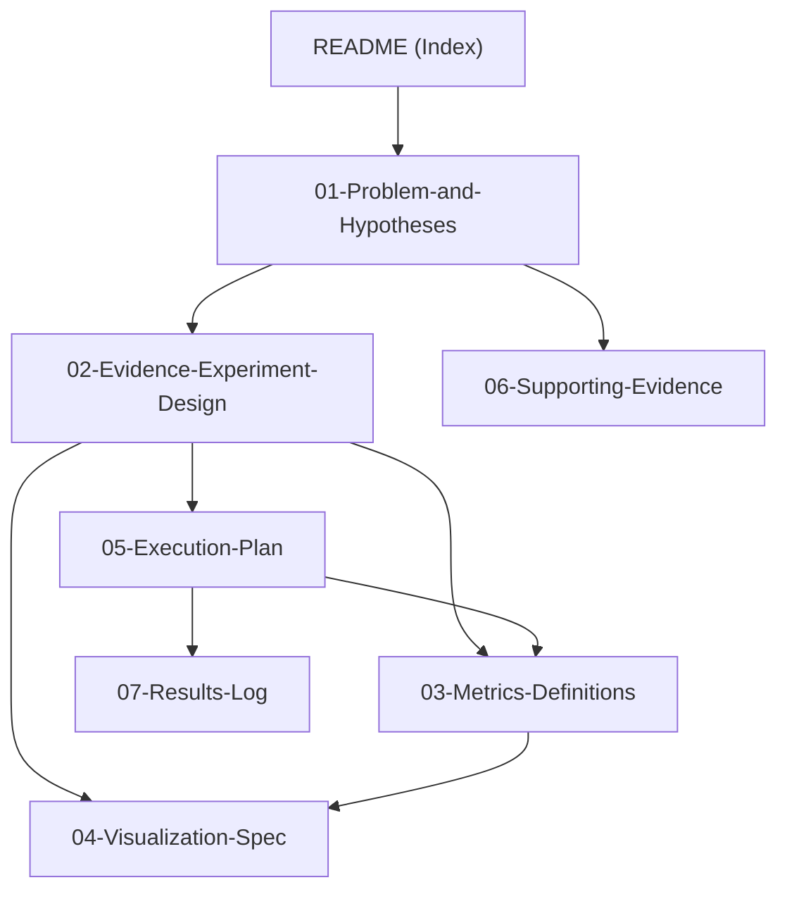

# Lexical Fallback in Quantized MLLMs — Evidence Study

> [!abstract] Current Scope
> **Team Phoenix — IIIT Hyderabad.** This vault documents the current research phase: **proving that Post-Training Quantization (PTQ) induces object hallucination in Multimodal LLMs (MLLMs) via Lexical Fallback** — the decoder losing visual fidelity and defaulting to linguistic priors. Only plans and experiments for this evidence study live here; future phases (methods, implementations) will be documented in this vault as the research progresses.

## Research Process

| Phase                                   | Status                                | Note                              |
| --------------------------------------- | ------------------------------------- | --------------------------------- |
| Background research & fact verification | ✅ Done                                | [[06-Supporting-Evidence]]        |
| Problem framing & hypotheses            | ✅ Done                                | [[01-Problem-and-Hypotheses]]     |
| Evidence experiment design              | ✅ Done                                | [[02-Evidence-Experiment-Design]] |
| Metric & statistical protocol           | ✅ Done                                | [[03-Metrics-Definitions]]        |
| Visualization spec                      | ✅ Done                                | [[04-Visualization-Spec]]         |
| Execution plan                          | ✅ Done                                | [[05-Execution-Plan]]             |
| Experiment results                      | ⏳ Pending — logged as experiments run | [[07-Results-Log]]                |

## Vault Map

## One-Paragraph Pitch

Extreme precision reduction (W4A8/W4A4) disproportionately corrupts the cross-modal representations of MLLMs — multimodal token activations carry significantly higher entropy than text (LUQ), so low-bit rounding damages visual conditioning before it damages language fluency. Our hypothesis: the quantized decoder then **falls back to statistical language priors**, producing tokens that are linguistically plausible but visually ungrounded — i.e., object hallucinations. This vault documents the experiment that establishes this: a **same-dataset ablation of hallucination and cross-modal attention across a precision grid** (FP16 → W8A8 → W4A8 → W4A4) on LLaVA-1.5 (7B/13B) and Qwen2-VL-7B. No published work performs this ablation; our study establishes the phenomenon and its mechanism.

## Key Facts (verified)

> [!warning] Architecture Correction
> Neither LLaVA-1.5 nor Qwen2-VL uses explicit cross-attention layers. Both fuse vision via projection into a single sequence processed by LLM **self-attention**. "Cross-modal attention" = attention from generated tokens to visual-token positions in self-attention. Details in [[06-Supporting-Evidence#Architecture Facts]].

## Deliverables

- [ ] Experiment harness config (lmms-eval + custom CHAIR)
- [ ] Quantization pipeline (AWQ / GPTQ / MQuant)
- [ ] Attention extraction hooks
- [ ] Correlation & statistical analysis
- [ ] Visualization suite (8 figures, per [[04-Visualization-Spec]])
- [ ] Evidence write-up (results logged in [[07-Results-Log]])

> [!info] Growing the Vault
> As research progresses, new notes get added here: experiment results and per-cell logs ([[07-Results-Log]]), follow-up experiments, and — in later research phases — method design and implementation documentation. The [[README]] map will be updated as the graph grows.

## Related

- [[01-Problem-and-Hypotheses]] — motivation, research questions, hypotheses
- [[02-Evidence-Experiment-Design]] — the ablation matrix and protocols
- [[03-Metrics-Definitions]] — hallucination + attention metrics, math
- [[04-Visualization-Spec]] — figure-by-figure spec
- [[05-Execution-Plan]] — phases, timeline, risks
- [[06-Supporting-Evidence]] — verified facts with primary sources
- [[07-Results-Log]] — experiment results, appended as they complete