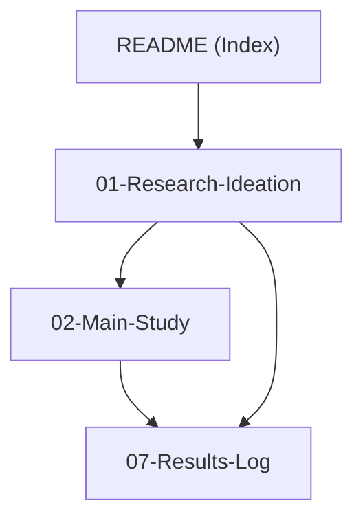

# Lexical Fallback in Quantized MLLMs — Research Vault

> [!abstract] Current Scope
> **Team Phoenix — IIIT Hyderabad.** Proving that Post-Training Quantization (PTQ) induces object hallucination in Multimodal LLMs (MLLMs) via **Lexical Fallback** — the decoder losing visual fidelity and defaulting to linguistic priors. The vault is organized around a research-ideation core, the main study experiment, and a running results log. Future research phases (methods, implementations) will be documented here as the research progresses.

## Vault Map

## Notes

| Note | Contents | Status |
|---|---|---|
| [[Research Ideation]] | **The quick-read:** research topic, lexical fallback, gaps, RQs, hypotheses H1–H4 + probes S1–S3, key verified facts, plan, metrics, figures, references | ✅ Base for all phases |
| [[Study Experiment]] | The main study: 7B GPTQ self-quantized (FP16/W8/W4) on full POPE (3 splits) + CHAIR with attention capture and text-only probe | ⏳ Planned |
| [[Results]] | Append-only experiment log + hypothesis verdict tracker | ⏳ Pending |

## One-Paragraph Pitch

Extreme precision reduction (W4A8/W4A4) disproportionately corrupts the cross-modal representations of MLLMs — multimodal token activations carry significantly higher entropy than text (LUQ), so low-bit rounding damages visual conditioning before it damages language fluency. Our hypothesis: the quantized decoder then **falls back to statistical language priors**, producing tokens that are linguistically plausible but visually ungrounded — i.e., object hallucinations. The research establishes this with a same-dataset ablation of hallucination and cross-modal attention across weight-precision versions (FP16 → W8 → W4) on LLaVA-1.5-7B: full POPE (all 3 contrastive splits) + CHAIR, with per-step attention and text-only prior attribution. No published work performs this ablation with attention-mechanism analysis; our study establishes the phenomenon and its mechanism.

## Deliverables

- [ ] Main study run ([[Study Experiment]]) → proposal initial results
- [ ] Correlation & statistical analysis (H1–H4 verdicts)
- [ ] Visualization suite (F1–F8, per [[Research Ideation#Figures Planned]])
- [ ] Evidence write-up (results logged in [[Results]])

> [!info] Growing the Vault
> As research progresses, new notes get added: follow-up experiments, method design and implementation documentation (future research phases). The map is updated as the graph grows.