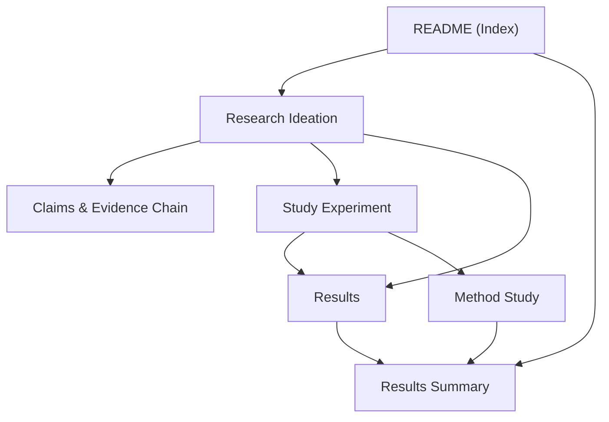

# Lexical Fallback in Quantized MLLMs — Research Vault

> [!abstract] Current Scope
> **Team Phoenix — IIIT Hyderabad.** Proving that Post-Training Quantization (PTQ) induces object hallucination in Multimodal LLMs (MLLMs) via **Lexical Fallback** — the decoder losing visual fidelity and defaulting to linguistic priors. The vault is organized around a research-ideation core, the main study experiment, a running results log, and the methods phase (LoRAS + A-CAB countermeasures) documented as the research progresses.

## Vault Map

```mermaid
graph TD
    A["README (Index)"] --> B["Research Ideation"]
    A --> R["Results Summary"]
    B --> E["Claims & Evidence Chain"]
    B --> C["Study Experiment"]
    C --> D["Results"]
    B --> D
    D --> R
    C --> M["Method Study"]
    M --> R
```

## Notes

| Note | Contents | Status |
|---|---|---|
| [[Research Ideation]] | **The quick-read:** research topic, lexical fallback, gaps, RQs, hypotheses H1–H4 + probes S1–S3, key verified facts, plan, metrics, figures, references | ✅ Base for all phases |
| [[Claims & Evidence Chain]] | The argumentative spine: 4 claims (hallucination is measurable → the head carries the bias → quantization inflates it → no bridging work exists) with primary sources | ✅ Verified |
| [[Study Experiment]] | The main study: 7B self-quantized precision ladder (FP16/W8A8/W4A16/W4A8/W4A4) on full POPE (3 splits) + CHAIR with attention capture and text-only probe | ✅ Resampled-100 run complete; full 500 pending |
| [[Results]] | Append-only experiment log + hypothesis verdict tracker | ⏳ Running (100-img run logged) |
| [[Method Study]] | **Methods phase (Phoenix, C2 & C3):** LoRAS + A-CAB on practically quantized LLaVA — PTQ validation, Gate 1/2 verdicts, drift profiling, 2×2 ablation, A-CAB sweep, token probe, LoRAS ceilings | ⏳ In progress (n=100 probe complete) |
| [[Results Summary]] | **The one-place synthesis:** verdict dashboard for both studies, the cross-study inference (omission vs fallback, W4A4 reconciliation, decoding as the strongest lever), cheat-sheet numbers | 🔒 Synced with the two detail notes |

## One-Paragraph Pitch

Extreme precision reduction (W4A8/W4A4) disproportionately corrupts the cross-modal representations of MLLMs — multimodal token activations carry significantly higher entropy than text (LUQ), so low-bit rounding damages visual conditioning before it damages language fluency. Our hypothesis: the quantized decoder then **falls back to statistical language priors**, producing tokens that are linguistically plausible but visually ungrounded — i.e., object hallucinations. The research establishes this with a same-dataset ablation of hallucination and cross-modal attention across a five-rung precision ladder (FP16 → W8A8 → W4A16 → W4A8 → W4A4) on LLaVA-1.5-7B: full POPE (all 3 contrastive splits) + CHAIR, with per-step attention and text-only prior attribution. No published work performs this ablation with attention-mechanism analysis; our study establishes the phenomenon and its mechanism.

## Deliverables

- [x] Evidence-study run at n=100 ([[Study Experiment]] → [[Results]]) — full 500-image run pending
- [ ] Correlation & statistical analysis (H1–H4 verdicts at full n)
- [x] Visualization suite (F1–F5 produced for the 100-img run; remaining per [[Research Ideation#Figures Planned]])
- [ ] Evidence write-up (results logged in [[Results]])
- [ ] Method-study validation at larger n ([[Method Study]] — LoRAS / A-CAB / Gate 1–2)

> [!info] Growing the Vault
> As research progresses, new notes get added: follow-up experiments, method design and implementation documentation (future research phases). The map is updated as the graph grows.