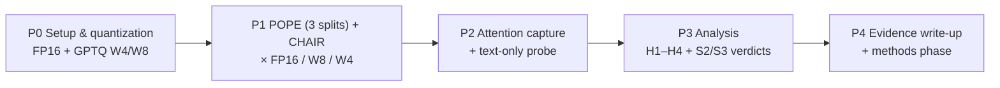

# Research Ideation — Lexical Fallback in Quantized MLLMs

> [!abstract] Purpose of this note
> The single quick-read for everything the research needs: problem, hypotheses, plans, key verified facts, and references. It is the **base for all future research phases** — the main study lives in [[Study Experiment]] and results accumulate in [[Results]].

## 1. Research Topic

Deploying MLLMs on edge hardware requires aggressive Post-Training Quantization (PTQ). Extreme precision reduction (W4A8/W4A4) disproportionately corrupts **cross-modal representations** — the visual token manifold projected into the language decoder. Unlike text tokens, multimodal token activations carry **significantly higher entropy** (Bhatnagar et al., 2025 — LUQ), so low-bit rounding destroys visual conditioning before it degrades language fluency.

> [!warning] Lexical Fallback (our defining failure mode)
> When visual token representations are degraded by quantization noise, the autoregressive generation head relies excessively on statistical **language priors**, sampling tokens that are linguistically probable but **visually ungrounded** — i.e., severe object hallucinations. The model "falls back" to behaving like a text-only LM.

**Why decoding-time is the right lens:** the failure is a *decoding-time symptom* of corrupted representations — it manifests in what the decoder attends to and samples. Research therefore measures two things on the same generations: task-level hallucination, and step-by-step cross-modal attention.

## 2. Motivation & Gaps

| Gap | Evidence |
|---|---|
| Quantization and decoding are studied separately | QSLaw, MQuant optimize reconstruction error, not generation behavior |
| Generation heads are agnostic to noise | Quantized MLLMs use full-precision sampling (greedy, nucleus) unchanged |
| Hallucination mitigations assume full precision | VCD, OPERA, DoLa benchmarked on uncompressed models |
| **No hallucination-focused study across precision levels** | LUQ reports POPE as one column among 9 benchmarks; no attention-mechanism analysis |

**Novelty:** first same-dataset, same-prompt ablation of hallucination across a precision grid (FP16→W4A4) on LLaVA-1.5 and Qwen2.5-VL *with* attention-mechanism analysis. Differentiators vs LUQ (sub-4-bit, POPE as one column): hallucination as object of study, full precision grid, attention mechanism, two model families. Related reliability work: arXiv:2602.13289 (PTQ × reliable VQA, no hallucination metrics). Full evidence chain with primary sources: [[Claims & Evidence Chain]]. Closest decoding-time prior: UHMF-V (thesis, quantized-VLM decoding mitigation) — positioned against in [[Claims & Evidence Chain#Claim 4]].

## 3. Research Questions

- **RQ1 (Existence):** Does hallucination increase monotonically as precision decreases, within the same dataset and prompt set?
- **RQ2 (Mechanism):** Does quantization measurably degrade cross-modal attention (mass, entropy, stability), coinciding with hallucination onset?
- **RQ3 (Causality):** At token level, are hallucinated tokens statistically less visually grounded than correct ones — is lost grounding a sufficient explanation?
- **RQ4 (Temporal):** Does visual grounding collapse over decoding steps (late-step fallback) rather than uniformly?

## 4. Hypotheses

> [!example] H1 — Precision monotonicity
> Hallucination rate (CHAIR_s, CHAIR_i, POPE-F1) increases monotonically with precision reduction: FP16 < W8A8 < W4A8 < W4A4, consistently across models and quantizers.
>
> Prior-support audit (what literature already establishes vs what we add): [[Claims & Evidence Chain#Where We Start — Hypothesis × Prior-Support Audit]]

> [!example] H2 — Attention degradation
> Quantization reduces visual attention mass $\bar{a}_v$ and increases attention entropy over visual tokens, with the largest drop at W4A4.

> [!example] H3 — Token-level grounding coupling
> Hallucinated object mentions receive significantly less visual attention than grounded ones (negative point-biserial correlation, $p < 0.05$).

> [!example] H4 — Temporal fallback
> Visual attention mass decays across decoding steps, and the decay is steeper and earlier for quantized models than FP16 — the "fallback timeline."

### Support probes (strengthen the causal chain)

> [!example] S1 — Noise-injection control
> At FP16, inject zero-mean Gaussian noise into visual embeddings with variance matched to the measured FP16↔W4A4 embedding error. If hallucination tracks *noise level* rather than quantizer identity, the mechanism is representation noise.

> [!example] S2 — Linguistic-prior probe
> Run the model with image masked (text-only condition). Hallucinated mentions should be high-probability under the text-only distribution; grounded mentions should not.
> **S2a — Prior-strength stratification:** bin POPE questions by text-only $P_{txt}(\text{yes})$; the FP16→W4 hallucination gap should grow monotonically with prior strength — quantitative fallback, not generic accuracy loss.
> **S2b — Distributional convergence:** the quantized output distribution should converge toward the text-only distribution:
> $$\Delta\text{KL}_c = \text{KL}\big(P_c(\cdot \mid x, v) \,\|\, P_{txt}(\cdot \mid x)\big) - \text{KL}\big(P_{FP16}(\cdot \mid x, v) \,\|\, P_{txt}(\cdot \mid x)\big) < 0$$
>
> Prior-support audit: [[Claims & Evidence Chain#Where We Start — Hypothesis × Prior-Support Audit]]

> [!example] S3 — Layer-depth attention profile
> Visual attention imbalance intensifies in deeper layers (RBD-style finding); quantization is expected to steepen this — informs which layers carry the fallback signal.

**Proof structure:** no single experiment proves fallback — it is an inferred mechanism, established by elimination: H1 (existence) → H2/H3/H4 (proximal mechanism = visual channel fails) → S2/S2a/S2b (disambiguates the substitution *source* = language prior, ruling out "just lost attention") → S1 (trigger = representation noise). Falsifiable: if hallucinated tokens aren't prior-favored, or ΔKL ≥ 0, fallback is refuted.

## 5. Key Verified Facts

### Architecture (drives all attention work)

- **LLaVA-1.5 (7B/13B):** CLIP ViT-L-14@336 → 2-layer MLP projector → Vicuna (LLaMA-2). 336² image = **576 visual tokens** concatenated into the LLM input; fusion via the LLM's own **self-attention** (positions 1–576). No cross-attention layers.
- **Qwen2.5-VL (3B/7B):** 675M ViT (DFN init, 2D-RoPE) → MLP merger (2×2→1) → Qwen2.5 LLM; `<|vision_start|>`/`<|vision_end|>` special tokens; **dynamic resolution** ⇒ visual span is input-dependent (resolved per input from special tokens).
- **Consequence:** "cross-modal attention" = attention from generated tokens to visual-token positions in LLM **self-attention**. No canonical attention-grounding metric exists in the literature — our per-token visual attention mass $\bar{a}_v(t)$ is itself a small contribution.
- **Qwen3.5-4B is unsuitable:** hybrid Gated DeltaNet + Gated Attention architecture — 24/32 layers are linear attention with no softmax attention distribution to measure; also too new for PTQ tooling/baselines.

### Benchmarks

- **POPE** (RUCAIBox/POPE, arXiv:2305.10355): 500 MSCOCO val2014 images (>3 GT objects) × 6 questions (3 yes / 3 no) = 3,000 per split; splits **random / popular / adversarial**; metrics Acc/Prec/Recall/**F1** + yes-ratio. **Contrastive by construction** (verified in the published files): all 3 splits share the same 500 images; "no" objects are high-prior traps (popular = frequent objects; adversarial = co-occurring objects).
- **CHAIR** (LisaAnne/Hallucination, arXiv:1809.02156): MLLM-era convention = 500 MSCOCO val2014 images, one detailed caption each; 80 COCO classes via official synonym list; GT = instance seg ∪ reference captions; CHAIR_s (sentence) / CHAIR_i (mention), lower better. **Image selection is seed-dependent** (OPERA's `chair_eval.py`: random shuffle, take 500) — fix our own seed and log image IDs.
- **Convention decision:** POPE and CHAIR keep their **own official image sets** (different subsets — POPE filtered, CHAIR random). The pairing that matters is within each benchmark across precision. Both are subsets of val2014 — intersection computed post-hoc only if cross-benchmark joint analysis is needed.
- ScienceQA / TextVQA: optional context benchmarks (reasoning/perception degradation framing), available via lmms-eval; CHAIR is **not** in lmms-eval (custom harness on LisaAnne's chair.py).

### Quantization landscape

| Method | Granularity | Notes |
|---|---|---|
| **GPTQ** (arXiv:2210.17323) | W4/W8 weight-only | AutoGPTQ archived Apr 2025 → use **GPTQModel**; transformers `GPTQConfig`; CPU-inference capable; TheBloke's 7B GPTQ repo deleted (13B branches survive) |
| **AWQ** (arXiv:2306.00978) | W4 weight-only (g128) | CUDA kernels; W4A16 only |
| **MQuant** (arXiv:2502.00425, MM'25) | W4A8/W4A4 weight+activation | Official code (StiphyJay/MQuant); CUDA-only kernels → CPU fallback = fake-quant simulation; built on QuaRot rotations (QuaRot itself is LLM-only) |
| QuaRot (arXiv:2404.00456) | LLM-only W4A4 | Not applicable to MLLMs per MQuant |

### Model feasibility (compute)

- Colab free (T4 16GB) and Kaggle free (2×T4, 30 h/wk) run 7B W4 comfortably (~4-5 GB); 7B FP16 (~14 GB) fits T4 batch-1; 13B W4 (~8 GB) fits; 13B FP16 is Kaggle-only.
- Qwen2.5-VL-**3B** is the CPU-viable option (~2 GB at W4). CPU runs ×10-20 slower than T4.
- Speeds (T4): 7B W4 ≈ 40 tok/s, FP16 ≈ 20 tok/s; attention capture ≈ 1.4× overhead.

## 6. Research Plan

### Phases

- **P0 — Setup & quantization:** download official LLaVA-1.5-7B; self-quantize GPTQ W4 (g128) + W8 via GPTQModel on T4 (~30 min); calibration ~128 MSCOCO train2014 samples, disjoint from eval; configs logged.
- **P1 — Evaluation grid:** POPE (all 3 splits, 9,000 questions) + CHAIR (500 captions) on FP16 / W8 / W4 — identical prompts, per-image seeds. Full protocol in [[Study Experiment]]. Resampling is a code-config option (`sample_images`, default = full set); docs track the full set unless a resampled run becomes the record.
- **P2 — Mechanism & attribution:** per-step attention capture (all layers/heads over the 576-token visual span); text-only probe on FP16 + W4 (per-question $P_{txt}$, per-step logits for ΔKL).
- **P3 — Analysis:** per-split POPE F1/yes-ratio, CHAIR_s/i, r_pb with bootstrap CIs, binned grounding curves, fallback timeline, ΔKL → verdicts for H1–H4, S2, S3.
- **P4 — Evidence & methods phase:** figures F1–F8, evidence write-up (feeds the proposal); decoding-time countermeasures begin in later research phases, documented here as they start.

### Compute budget (T4 free tier, full sets)

**~13–14 GPU-h** on one T4: POPE ~3.3 h + CHAIR ~4.7 h (×3 variants) + text-only probe ~4 h + quantization ~0.5 h + analysis ~1 h. ≈ 1 Kaggle week (30 h/wk) or ~6–8 h wall-clock on both T4s in parallel; ~2 Colab sessions. A resampled config (e.g., 100 images/split + CHAIR-100) cuts to ~3–3.5 h.

### Key risks

| Risk | Mitigation |
|---|---|
| AutoGPTQ archived | GPTQModel (pinned transformers version) |
| CHAIR not in lmms-eval | Custom harness on LisaAnne chair.py, validated on published FP16 numbers |
| Quantized model degenerates at W4 | Mark cell "collapsed" and report it as a finding (collapse is evidence) |
| H3 coupling weak at token level | Sentence/step-window-level coupling (H4) as hedge; report honestly |
| Future extension to W4A4/activation quantization | Inherits AWQ/MQuant CUDA-only constraints → fake-quant simulation fallback |

## 7. Metrics at a Glance

- **Hallucination:** CHAIR_s / CHAIR_i; POPE Acc/F1/yes-ratio.
- **Attention:** per-token visual attention mass $A^{(l,h)}_v(t) = \sum_{i \in \mathcal{V}} a^{(l,h)}_{t,i}$; aggregated $\bar{a}_v(t)$ over heads/layers; entropy $H_v(t) = -\sum_{i \in \mathcal{V}} p_{t,i}\log_2 p_{t,i}$ over visual positions; argmax drift; step-window profile.
- **Attribution:** text-only $P_{txt}$ per question/mention; binned grounding curve (attention decile → hallucination rate); ΔKL distributional convergence.
- **Statistics:** point-biserial r_pb with bootstrap CIs (resample images), McNemar (POPE), Wilcoxon (attention), Benjamini-Hochberg correction across the hypothesis family.

## 8. Figures Planned

F1 hallucination-vs-precision bars · F2 fallback timeline (attention over decoding steps) · F3 attention↔hallucination scatter with logistic fit · F4 binned grounding curve · F5 attention entropy distributions · F6 attention heatmaps (qualitative) · F7 reasoning trade-off (optional, needs ScienceQA/TextVQA) · F8 case-study table. All map to H1–H4 and the S-probes.

## 9. References & Verified Facts

**Primary sources (verified 2026-08-25; new claims-level sources 2026-08-27 in [[Claims & Evidence Chain]]):**

- Ashkboos, S., et al. 2024. QuaRot: Outlier-free 4-bit inference in rotated LLMs. arXiv:2404.00456 · github.com/spcl/QuaRot (LLM-only)
- Belsare, S., et al. 2026. GridVQA-X. arXiv:2606.14740 · github.com/AikyamLab/grid-vqax (synthetic contrastive-generation template)
- Bhatnagar, S., et al. 2025. LUQ. arXiv:2509.23729 · shubhangb97.github.io/LUQ (evaluated LLaVA-1.5 + Qwen2.5-VL; POPE included; no public code)
- Chuang, Y.-S., et al. 2024. DoLa. ICLR.
- Frantar, E., et al. 2023. GPTQ. ICLR. arXiv:2210.17323 · github.com/ModelCloud/GPTQModel (AutoGPTQ archived Apr 2025)
- Huang, Q., et al. 2024. OPERA. CVPR. arXiv:2311.17911 · github.com/shikiw/OPERA (summary-token overtrust; chair_eval.py = random-500 protocol)
- Leng, S., et al. 2024. VCD. CVPR. arXiv:2311.16922 · github.com/DAMO-NLP-SG/VCD (language-prior mechanism)
- Li, Y., et al. 2023. POPE. EMNLP. arXiv:2305.10355 · github.com/RUCAIBox/POPE
- Lin, J., et al. 2024. AWQ. MLSys. arXiv:2306.00978 · github.com/mit-han-lab/llm-awq
- Liu, H., et al. 2024. LLaVA-1.5. NeurIPS. arXiv:2310.03744 · github.com/haotian-liu/LLaVA · huggingface.co/liuhaotian/llava-v1.5-7b
- Rohrbach, A., et al. 2018. CHAIR. EMNLP. arXiv:1809.02156 · github.com/LisaAnne/Hallucination
- Wang, P., et al. 2024. Qwen2-VL. arXiv:2409.12191 (Qwen2.5-VL same family; repo redirects to QwenLM/Qwen3-VL)
- Yu, J., et al. 2025. MQuant. ACM MM. arXiv:2502.00425 · github.com/StiphyJay/MQuant

**Attention↔hallucination anchors:** OPERA (arXiv:2311.17911, summary tokens neglect image), VCD (arXiv:2311.16922, unimodal priors), RBD (arXiv:2409.06485, visual tokens ~25% of attention, deeper layers worse), ASCD (arXiv:2506.14766, contrastive decoding lowers visual attention), MIHBench (arXiv:2508.00726), HDPO (arXiv:2411.10436), **POPEv2 probing** (arXiv:2508.04567, AAAI 2026 — bias resides in the LM head; visual info present in hidden states but generation ignores it).

**Quantization × hallucination (claim-level evidence):** **ImpQuant** (ICML 2026 poster 64367 — explicitly reduces *quantization-induced object hallucinations*), **LUQ** (arXiv:2509.23729, POPE among 9 benchmarks), **PTQ × reliable VQA** (arXiv:2602.13289, accuracy + ECE degradation), **UHMF-V** (hdl.handle.net/10356/213843 — decode-time mitigation for 4-bit LLaVA-1.5), **QIG** (arXiv:2603.17809) and **VLMQ** (arXiv:2508.03351) (visual-token fragility under PTQ), **Quantized but Deceptive?** (aclanthology.org/2025.emnlp-main.1548), **Tethered Reasoning** (arXiv:2602.17691).

**Hallucination benchmark landscape:** POPEv2 (arXiv:2508.04567, counterfactual pairs), HOPE (arXiv:2508.06530, harder distractors — POPE caveat), HallusionBench (arXiv:2310.18834), TGIF (arXiv:2601.03100, POPE+HallusionBench adoption).

**Correction log (assumptions overturned by verification):** Qwen2-VL has no cross-attention; POPE repo is RUCAIBox (shikohome dead); QuaRot repo is spcl (LLM-only); AutoGPTQ archived; AWQ is W4A16 weight-only; TextVQA repo dead (textvqa.org + lmms-eval); CHAIR not in lmms-eval; LUQ used Qwen2.5-VL; TheBloke 7B GPTQ deleted (13B survives).

## Related Notes

- [[Claims & Evidence Chain]] — the claims → evidence → hypotheses spine
- [[Study Experiment]] — the main study experiment
- [[Results]] — results, appended as experiments complete
- [[README]] — vault index